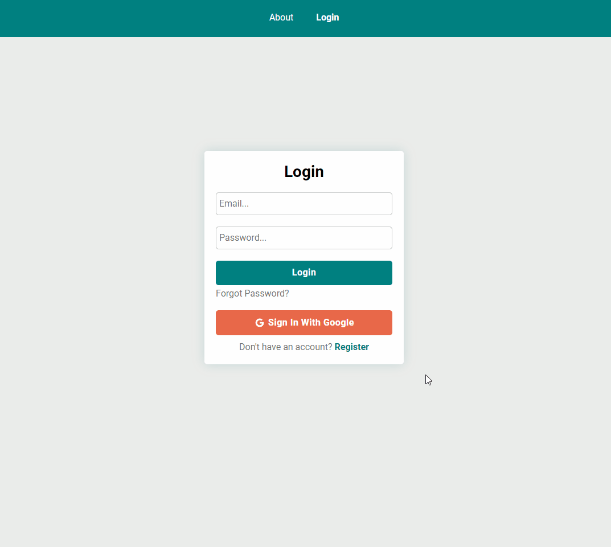
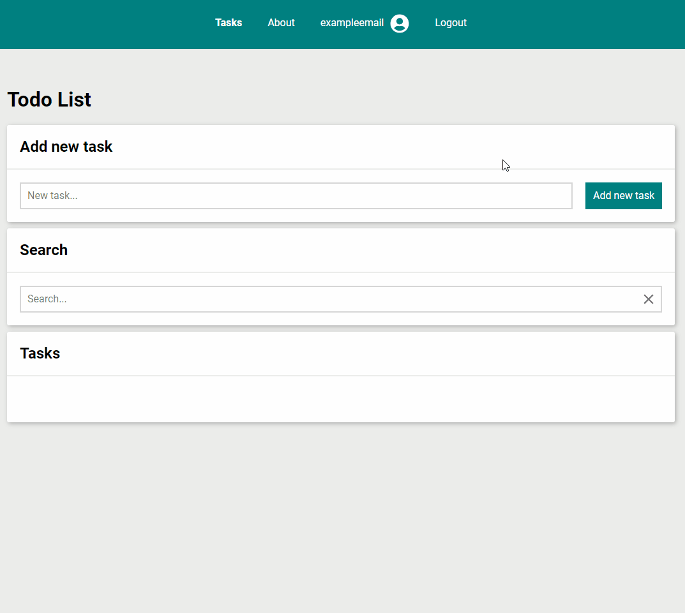
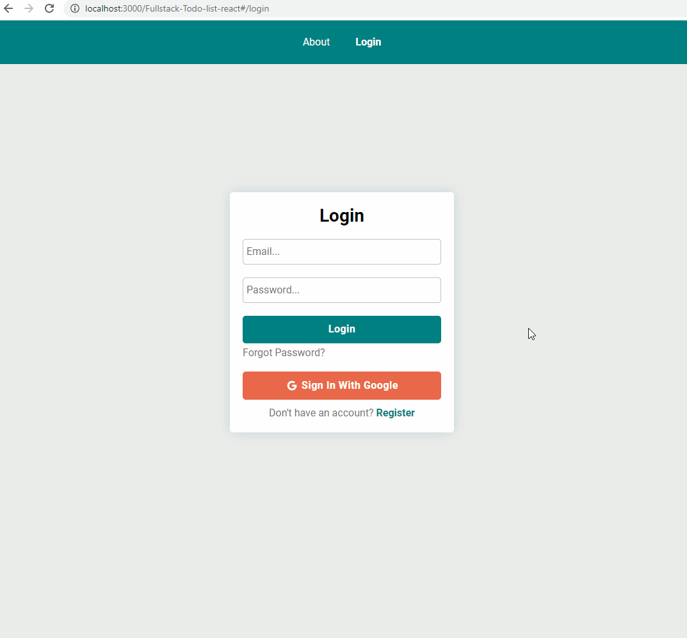

# 📝 Todolist - Version Fullstack React

## Description

Bienvenue dans Todolist - Version Fullstack React ! 🎉
Ce projet est une application de gestion de tâches (todolist), développée en utilisant React pour le front-end et une architecture back-end robuste, permettant de gérer efficacement vos tâches quotidiennes.

L'application reprend les principes d'une todolist classique, mais avec une interface moderne et intuitive. Grâce à une expérience utilisateur fluide, vous pouvez facilement ajouter, modifier ou supprimer des tâches, et garder une trace de vos priorités, directement depuis votre navigateur.

## How I try to stand out

### Features added independently of the YouCode course

    ✔ Connecting application with Firebase
    ✔ User authentication
    ✔ The ability to edit task title
    ✔ Task creation date
    ✔ Deadline functionality
    ✔ Notes field bootstrapped with tiny
    ✔ Tasks deadline filtering system
    ✔ Images storage
    ✔ Navigation menu with with swipe events
    ✔ User page
    ✔ Capability to change:
        - profile picture
        - user name
        - password
        - email
    ✔ Capability to delete account

## Page Preview

### Register page



### Tasks page



### Single task page


### Not found page



## Configuration Firebase

Pour que l'application fonctionne correctement avec votre propre base de données Firebase, vous devez remplacer les paramètres de configuration dans le fichier src/config/firebase.js avec les vôtres.
Dans src/config/firebase.js, vous trouverez un objet de configuration Firebase qui ressemble à ceci :

```
const firebaseConfig = {
  apiKey: process.env.REACT_APP_API_KEY,
  authDomain: process.env.REACT_APP_AUTH_DOMAIN,
  projectId: process.env.REACT_APP_PROJECT_ID,
  storageBucket: process.env.REACT_APP_STORAGE_BUCKET,
  messagingSenderId: process.env.REACT_APP_MESSAGING_SENDER_ID,
  appId: process.env.REACT_APP_APP_ID,
};

```

## Security

With Firebase security rules, your account, data and files will not fall into the wrong hands.

### How it works

Firebase Security Rules stand between your data and malicious users.

Firebase Security Rules work by matching a pattern against database paths, and then applying custom conditions to allow access to data at those paths. All Rules across Firebase features have a path-matching component and a conditional statement allowing read or write access. Rules are defined for each Firebase feature in this app to ensure only you can access your account's information.

## Create React App

This project was bootstrapped with [Create React App](https://github.com/facebook/create-react-app).

## Available Scripts

In the project directory, you can run:

### `npm start`

Runs the app in the development mode.\
Open [http://localhost:3000](http://localhost:3000) to view it in your browser.

The page will reload when you make changes.\
You may also see any lint errors in the console.

### `npm run build`

Builds the app for production to the `build` folder.\
It correctly bundles React in production mode and optimizes the build for the best performance.

The build is minified and the filenames include the hashes.\
Your app is ready to be deployed!

See the section about [deployment](https://facebook.github.io/create-react-app/docs/deployment) for more information.

### `npm run eject`

**Note: this is a one-way operation. Once you `eject`, you can't go back!**

If you aren't satisfied with the build tool and configuration choices, you can `eject` at any time. This command will remove the single build dependency from your project.

Instead, it will copy all the configuration files and the transitive dependencies (webpack, Babel, ESLint, etc) right into your project so you have full control over them. All of the commands except `eject` will still work, but they will point to the copied scripts so you can tweak them. At this point you're on your own.

You don't have to ever use `eject`. The curated feature set is suitable for small and middle deployments, and you shouldn't feel obligated to use this feature. However we understand that this tool wouldn't be useful if you couldn't customize it when you are ready for it.

## Auteurs

* **Gabriel Gonta** - *Initial work* - [BurgerQuizGame](https://github.com/gabrielgonta/ToDoList.git)